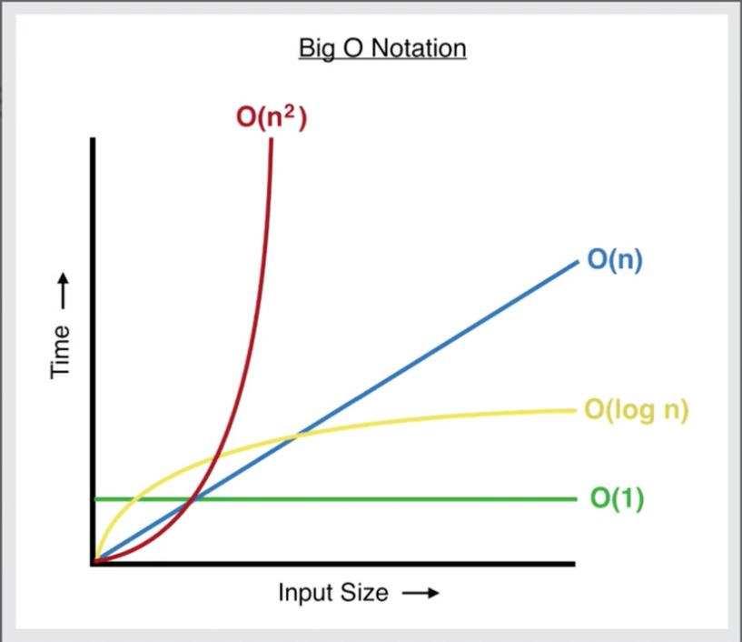

**Always 3 operations O(1)**
```js
function addUpTo(n){
  return n*(n+1)/ 2
}
```


O(n) 

```js
function addUpTo(n){
  let total = 0;
  for(let i = 1; i <=n; i++){
    total += i;
  }
  return total
}
```

O(n^2)

```js
function printAllPairs(n){
  for (var i = 0; i < n; i ++){
    for (var j = 0; j<n; j++){
      console.log(i,j)
    }
  }
}
```


O(2n) -> O(n)
O(500) -> O(1)
O(13N^2)-> O(n^2)

## Big O of Obj:
inseartion: O(1)
removal: O(1)
searching: O(n)
access: O(1)

### Methods:
Object.keys: O(n)
Object.values: O(n)
Object.entries: O(n)
hasOwnProperty: O(1)

